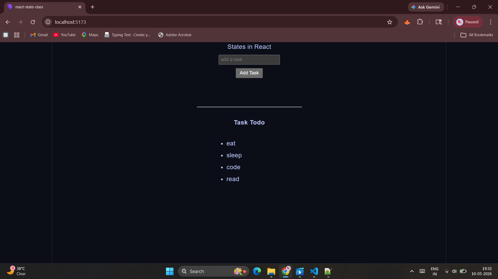

# 📝 React ToDo App

A simple ToDo List application built while learning React Hooks and state management using `useState`.

## 🚀 Features
- Add tasks dynamically
- Real-time input handling
- Unique task IDs using UUID
- React Hooks (`useState`)
- Dynamic list rendering
- Beginner-friendly React project

## 🛠️ Tech Stack
- React.js
- JavaScript
- CSS
- HTML

## 📚 Concepts Practiced
- React Hooks
- `useState`
- Event handling
- State updates
- Rendering lists with `.map()`
- Using unique keys in React lists`

## 📷 Screenshot

